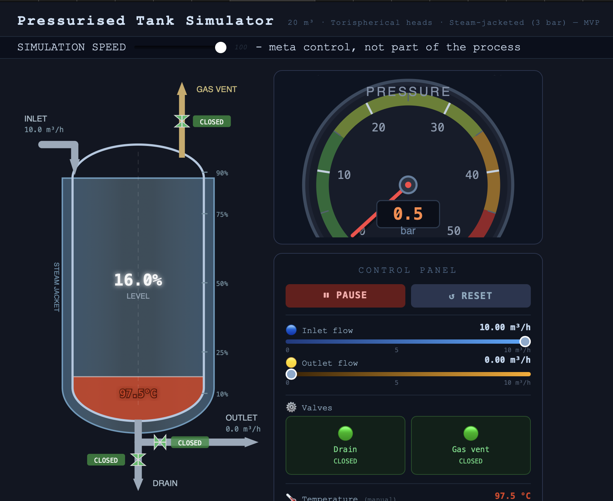

# Pressurised Tank Simulator

A real-time 2D process simulation of a pressurised, steam-jacketed vessel. Built as an engineering portfolio piece exploring interactive simulation, reactive state management, and automated deployment.

**[Live demo → philippecosta.de/tank-sim](https://philippecosta.de/tank-sim/)**



---

## Features

- **SVG process drawing** — torispherical-head vessel with steam jacket, inlet/outlet/drain/gas-vent nozzles and valve symbols
- **Live simulation** — level, pressure, and temperature update at 10 Hz based on simplified physics rules
- **Visual encoding** — liquid fill height maps to level; colour maps to temperature (blue → cyan → green → amber → red); animated pressure gauge needle
- **Controls** — flow rate sliders, valve toggles, run/pause/reset
- **Energy balance stub** — jacketed heating by saturated steam (3 bar / 133.5 °C) is fully modelled in comments, ready to activate
- **CI/CD** — push to `main` builds and deploys automatically via GitHub Actions

---

## Stack

| Layer | Technology |
|---|---|
| Frontend | Vue 3 + Vite |
| State | Pinia |
| Visualisation | SVG (hand-authored) |
| Deployment | GitHub Actions → rsync → Hetzner VPS |
| Serving | Caddy (reverse proxy, HTTPS) |

---

## Architecture

```
Browser
  └── Vue 3 SPA
        ├── Pinia store (simulation loop @ 10Hz)
        │     └── physics rules isolated in tankStore.js
        ├── TankSVG.vue       — process drawing
        ├── PressureGauge.vue — animated gauge
        └── Controls.vue      — sliders + valve toggles

CI/CD
  └── push to main
        → GitHub Actions (pnpm install + vite build)
        → rsync dist/ to /var/www/tank-sim
        → Caddy serves at philippecosta.de/tank-sim/
```

---

## Run Locally

```bash
git clone https://github.com/philippecosta/tank-sim
cd tank-sim
pnpm install
pnpm dev
```
